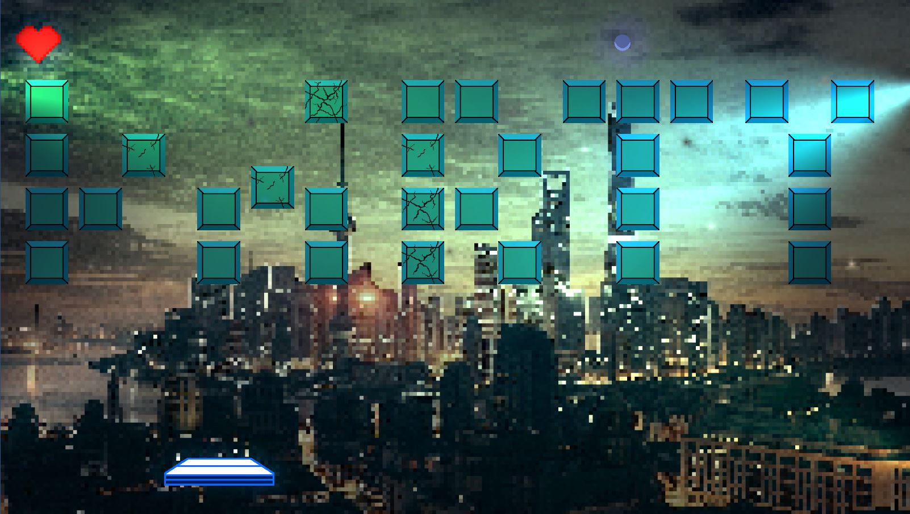
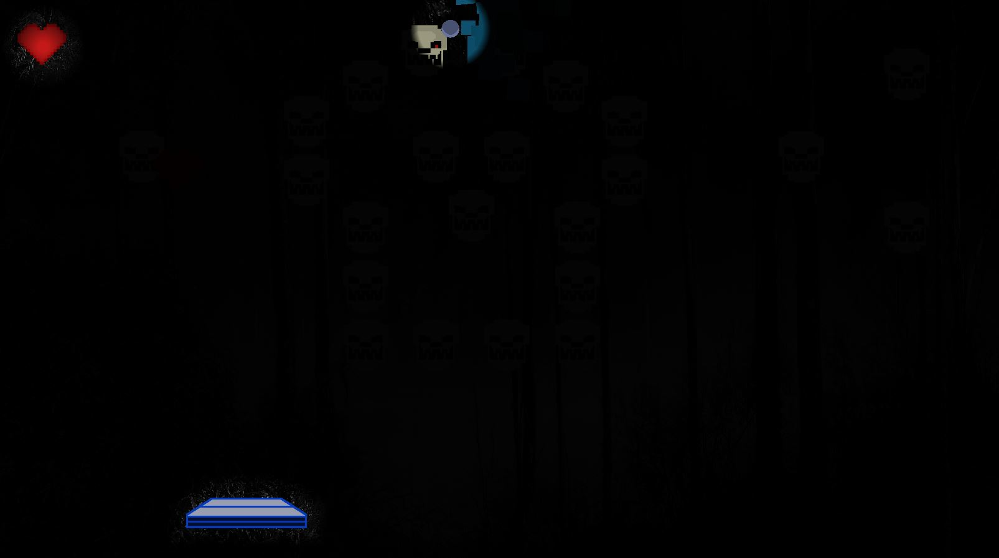
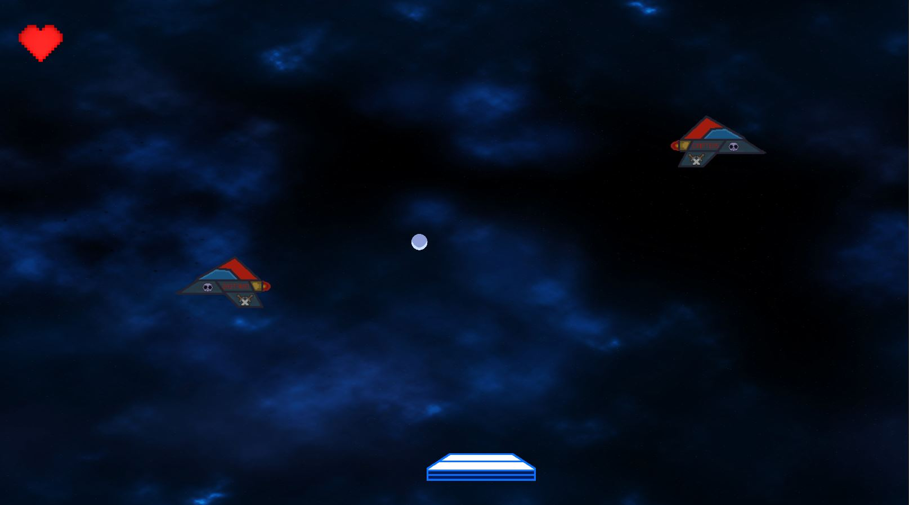

# Block-Destroyer

## Table of Contents

- [General info](#general-info)
- [Demo](#demo)
- [Built With](#built-with)
- [To Do](#to-do)
- [Status](#status)
- [Screenshots](#screenshots)
- [Additional sources](#additional-sources)

## General info

A 2D computer game from the Brick Breaker genre. 
It offers three different levels with different rules and scenery: party level, dark forest level and space level.
The player also has the option of collecting four different special super powers such as a fireball or extra life.
This is my first game made using Unity as part of the repetition of knowledge gained from the course: Complete C# Unity Developer 2D: Learn to Code Making Games (which I recommend to anyone interested in creating games).

## Demo

Soon...

## Built With

Stack:

- C#
- Unity - 2019.4.1
- Lightweight RP - 7.4.1
- Dynamic Space Background Lite - 1.1 
- Piskel (pixel art)
- Bfxr (sounds)

## To Do

- More levels
- Code refactor

## Status

Project is: in progess

## Screenshots

Party Level

Dark Forest Level

Space Battle Level

## Additional sources

- Complete C# Unity Developer 2D: Learn to Code Making Games - https://www.udemy.com/course/unitycourse/
- Dynamic Space Background Lite asset - https://assetstore.unity.com/packages/2d/textures-materials/dynamic-space-background-lite-104606
- Piskel - https://www.piskelapp.com/